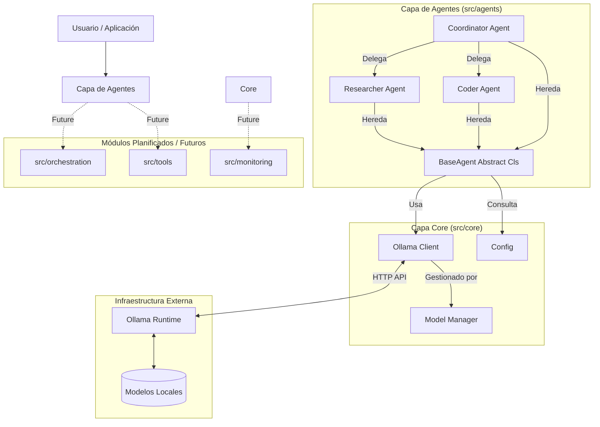

# Arquitectura del Sistema de Agentes de IA

## 1. Visión General del Sistema

Este sistema implementa una arquitectura modular para la ejecución local de LLMs y la orquestación de agentes inteligentes. El diseño separa claramente la capa de infraestructura (Core) de la lógica de negocio (Agentes), permitiendo una fácil extensibilidad y mantenimiento.

### Diagrama de Arquitectura

## 2. Profundización: Capa Core (`src/core`)

La capa Core gestiona la infraestructura base necesaria para que los agentes operen.

### 2.1 OllamaClient (`ollama_client.py`)
Cliente asíncrono que actúa como puente entre Python y el servidor local de Ollama.

- **Tecnología**: Utiliza `httpx` para comunicaciones HTTP asíncronas no bloqueantes.
- **Funcionalidades Clave**:
    - `generate(model, prompt, ...)`: Generación de texto estándar.
    - `chat(model, messages, ...)`: Completado de chat compatible con el formato de mensajes de OpenAI.
    - `pull_model(model)`: Descarga de modelos bajo demanda con streaming de progreso.
    - `check_health()`: Verificación de conectividad con el servicio Ollama.
- **Manejo de Errores**: Captura excepciones de red y errores de API, propagándolos con logging estructurado (`loguru`).

### 2.2 ModelManager (`model_manager.py`)
El cerebro detrás de la selección y gestión de modelos. Implementa un sistema de clasificación por "Tiers" para recomendar el modelo adecuado según el hardware y la tarea.

- **Estructura de Datos `ModelInfo`**: Define metadatos críticos como tamaño en GB, uso de VRAM, fortalezas y casos de uso.
- **Sistema de Tiers**:
    - **Tier 1 (Uso General)**: Modelos equilibrados como `Llama 3.2 8B`, `Mistral 7B` y `DeepSeek-R1 8B`.
    - **Tier 2 (Especialización)**: Modelos más pesados o específicos como `Phi-4 14B` o `Qwen 2.5 7B` (Coding).
    - **Tier 3 (Ultra-Ligeros)**: Modelos para baja latencia o hardware limitado, como `Phi-3 Mini` o `TinyLlama`.
- **Lógica de Recomendación**: El método `get_recommended_model(use_case)` selecciona automáticamente el mejor modelo. Por ejemplo, si el caso de uso es "coding", retornará `Qwen 2.5`.

### 2.3 Configuración (`config.py`)
Centraliza la configuración utilizando `pydantic-settings`.

- **Fuentes**: Lee variables de entorno del sistema y de archivos `.env`.
- **Validación**: Asegura que las rutas (paths) existan y que los tipos de datos sean correctos (ej. enteros para puertos).
- **Principal**: `Settings` singleton que expone `OLLAMA_HOST`, rutas de logs, y directorios de modelos.

## 3. Profundización: Capa de Agentes (`src/agents`)

Los agentes encapsulan la lógica de "razonamiento" y ejecución de tareas. Todos heredan de una clase base común.

### 3.1 BaseAgent (`base_agent.py`)
Clase abstracta que define el contrato de todos los agentes.

- **Ciclo de Vida**:
    1. **Inicialización**: Carga configuración y cliente Ollama.
    2. **Run (`run`)**: Recibe una tarea, prepara el prompt (inyectando contexto si existe), invoca al modelo, guarda el historial y retorna la respuesta.
    3. **Chat (`chat`)**: Mantiene un historial de conversación (`conversation_history`) para interacciones continuas.
- **Gestión de Estado**: Mantiene el historial de mensajes localmente para cada instancia.

### 3.2 Agentes Especializados (`src/agents/types/`)

#### ResearcherAgent (`researcher_agent.py`)
Especialista en análisis y síntesis de información.
- **Modelo Preferido**: `DeepSeek-R1 8B` (optimizado para razonamiento y chain-of-thought).
- **Capacidades**:
    - `research(topic, depth)`: Realiza investigaciones con profundidad configurable (shallow, medium, deep).
    - `analyze_document(doc, questions)`: Extracción de información de textos largos.
    - `compare_and_contrast(item1, item2)`: Análisis comparativo estructurado.
- **Estrategia de Prompt**: Utiliza instrucciones que fuerzan al modelo a "descomponer el problema" y "proporcionar evidencia".

#### CoderAgent (`coder_agent.py`)
Ingeniero de software virtual.
- **Modelo Preferido**: `Qwen 2.5 7B` (State-of-the-art en coding para su tamaño).
- **Temperatura**: Configurada baja (`0.3`) para resultados deterministas y sintácticamente correctos.
- **Capacidades**:
    - `generate_code`: Escribe soluciones completas.
    - `review_code`: Analiza código existente buscando bugs y mejoras.
    - `debug_code`: Toma un error y código, y propone correcciones.
    - `write_tests`: Genera suites de pruebas unitarias.

#### CoordinatorAgent (`coordinator_agent.py`)
Gerente de proyecto que orquesta otros agentes.
- **Modelo Preferido**: `Llama 3.2` (buen balance de instrucción general).
- **Flujo de Trabajo**:
    1. **Planificación (`plan_task`)**: Desglosa una tarea compleja en subtareas.
    2. **Delegación**: Asigna subtareas a agentes registrados (`register_agent`) basándose en sus capacidades.
    3. **Síntesis (`delegate_and_synthesize`)**: Recopila respuestas de los sub-agentes y genera un informe final unificado.

## 4. Módulos Planificados / Futuros

Las siguientes rutas existen en la estructura del proyecto pero actualmente funcionan como placeholders para futuras extensiones:

- **`src/orchestration`**: Destinado a implementaciones más complejas de grafos de agentes (ej. usando LangGraph) más allá de la coordinación simple actual.
- **`src/tools`**: Espacio reservado para la implementación del `ToolRegistry` y herramientas externas (búsqueda web, ejecución de código, acceso a filesystem) que los agentes podrán invocar.
- **`src/monitoring`**: Módulo futuro para métricas de rendimiento detalladas (tokens/seg, latencia de API) y observabilidad del sistema.
